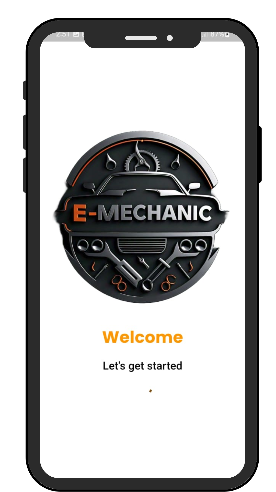
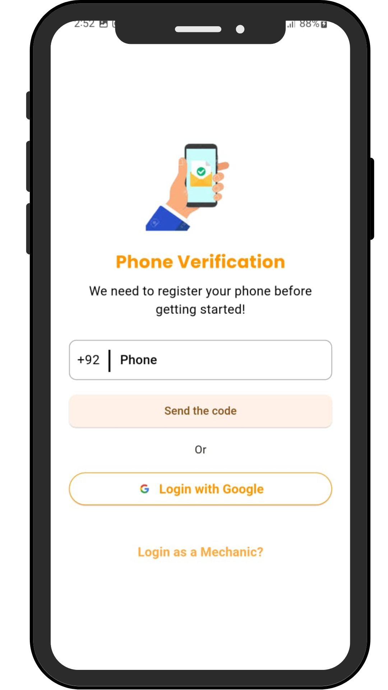

# E-Mechanic

**E-Mechanic** is a user-friendly Flutter application designed to provide seamless mechanic services for car owners. With this app, users can easily find nearby mechanics, book appointments, track service progress, and much more. The app connects users with professional mechanics for efficient and reliable car repairs.

## Features
- **User Registration & Login**: Secure authentication using Firebase.
- **Mechanic Search**: Find mechanics based on your location or required service.
- **Appointment Booking**: Schedule mechanic visits at convenient times.
- **Service Tracking**: Track the progress of your vehicle’s repair in real-time.
- **Ratings & Reviews**: Rate mechanics after service completion to help others.
- **Push Notifications**: Receive updates about your appointment status and service progress.
- **Map Integration**: Easily find nearby mechanics using Google Maps.

## Tech Stack
- **Flutter**: Cross-platform mobile development.
- **Firebase**: Authentication, database, and push notifications.
- **Google Maps API**: Location and mapping features.

## Screenshots
Below are some screenshots of the app's UI:

 

 

 

 
 
 
